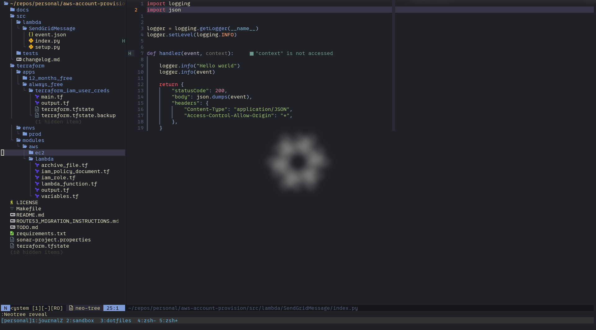
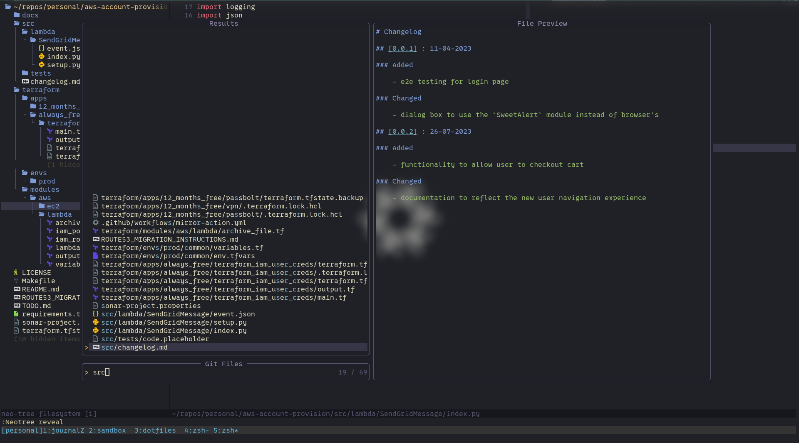
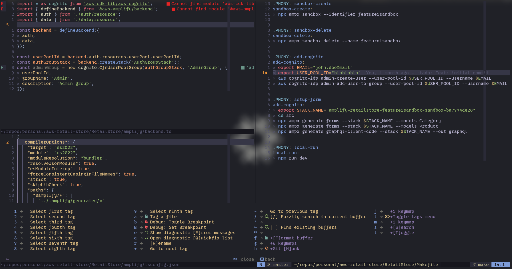

# :fire: Neovim configuration :fire:

<div align="center">
<p>
    <a>
      
    </a>
    <a href="https://github.com/neovim/neovim/releases/tag/stable">
      
    </a>
    <a href="https://github.com/IliyanKostov9/nvim-config/search?l=vim-script">
      
    </a>

[](https://www.gnu.org/licenses/gpl-3.0.en.html)
[](https://github.com/iliyan-kostov9/nvim-config/actions?query=branch%3Amaster)
[](https://github.com/iliyan-kostov9/nvim-config/actions/workflows/gitguardian.yaml)

[](#)
[](#)
[](#)
[](#-license)
</div>

:star: Star us on GitHub — it motivates us a lot!

## 🚀 About

> My personal Neovim configuration.
> 

This project contains my personal neovim keybindings, along with a few plugins, that help me be more productive when coding! 

> [!INFO]
> I have started using Neovim by using the [kickstart](https://github.com/nvim-lua/kickstart.nvim) template. This was recommended by [The Primeagen](https://github.com/ThePrimeagen)

## 🏝️ Environment

<p align="center">





</p>

## 🏗️ Structure
I have ordered my modules into different categories:

```markdown
.
├── assets
│  └── neovim_image.png
├── health.lua
├── init.lua
├── lazy-lock.json
├── LICENSE
├── lua
│  ├── code
│  │  ├── init.lua
│  │  └── plugins
│  ├── core
│  │  ├── init.lua
│  │  └── plugins
│  ├── fso
│  │  ├── init.lua
│  │  └── plugins
│  ├── git
│  │  ├── init.lua
│  │  └── plugins
│  ├── helpers
│  │  ├── init.lua
│  │  └── plugins
│  ├── managers
│  │  ├── lazy.lua
│  │  └── ui.lua
│  ├── settings
│  │  ├── autocmd.lua
│  │  ├── init.lua
│  │  ├── keymaps.lua
│  │  └── options.lua
│  ├── themes
│  │  ├── init.lua
│  │  └── plugins
│  └── tracking
│     ├── init.lua
│     └── plugins
└── README.md
```


| Module           | Description      |
| :------------- | :----------: |
| Assets         |Contains the most essential type of plugins|
| health.lua         |Used for verifying if there are any configuration issues with Neovim|
| init.lua         |Entry point of Neovim configuration|
| Lazy-lock.json         |auto generated file, when building the plugins, managed by LazyVim. It is used for pinning the plugins to specific versions|
| Code         |Plugin directory for storing code improvements (auto-indent, linting, etc)|
| Core         |Contains the most essential plugins. That plugin directory will be the least modified one, comparing to the rest|
| fso (File System Objects)         |Contains plugin related features for displaying or manipulating with he file system tree|
| git          |Used for storing git related plugins|
| helpers          |Plugins, that are uncategorized and help with further using Neovim (mostly related when writing markdown) |
| managers          |Plugin manager installer directory|
| settings          |Related for storing keymaps and plugin specific options|
| settings          |Related for storing keymaps and plugin specific options|
| themes          |Plugin directory for storing themes for Neovim|
| tracking          |Plugin directory for tracking any type of events when using Neovim (for example track the time and type of language when coding)|

## 🔌 Plugins 

<details>
<summary>Expand to view plugins</summary>

1. Code
- [autopairs](https://github.com/windwp/nvim-autopairs)
- [debug](https://github.com/mfussenegger/nvim-dap)
- [indent_line](https://github.com/lukas-reineke/indent-blankline.nvim)
- [jupyter]()
- [lint](https://github.com/mfussenegger/nvim-lint)

2. Core
- [cmp](https://github.com/hrsh7th/nvim-cmp)
- [conform](https://github.com/stevearc/conform.nvim)
- [grapple]()
- [harpoon]()
- [lspconfig](https://github.com/neovim/nvim-lspconfig)
- [mini](https://github.com/echasnovski/mini.nvim)
- [nvim-java]()
- [telescope](https://github.com/nvim-telescope/telescope.nvim)
- [treesitter](https://github.com/nvim-treesitter/nvim-treesitter)

3. Fso
- [neo-tree](https://github.com/nvim-neo-tree/neo-tree.nvim)

4. Git
- [gitsigns](https://github.com/lewis6991/gitsigns.nvim)
- [vim-fugitive](https://github.com/tpope/vim-fugitive)

5. Helpers
- [Comment](https://github.com/numToStr/Comment.nvim)
- [better-escape](https://github.com/max397574/better-escape.nvim)
- [ltex-ls]()
- [markdown-preview]()
- [todo-comments](https://github.com/folke/todo-comments.nvim)
- [undotree](https://github.com/mbbill/undotree)
- [which-key](https://github.com/folke/which-key.nvim)

6. Managers
- [LazyVim]()
- UI - *not a plugin, but a configuration extension to LazyVim*

7. Settings *Not a plugin*
- [autocmd]()
- [keymaps]()
- [options]()

8. Themes
- [kanagawa](https://github.com/rebelot/kanagawa.nvim)
- [rose-pine]()
- [vim-devicons](https://github.com/ryanoasis/vim-devicons)

9. Tracking
- [Wakatime](https://wakatime.com/neovim-plugin)

</details>

##  :wrench: LSP (Mason)
This part contains all of the Language servers.

<details>
<summary>Expand to view LSP</summary>

<ul>
<li>Ansible
<ul>
<li>ansible-language-server</li>
<li>ansible-lint</li>
</ul>

<li>Terraform
<ul>
<li>terraform-ls</li>
<li>tflint</li>
</ul>

<li>Python
<ul>
<li>black</li>
<li>pylint</li>
<li>pyright</li>
<li>mypy</li>
<li>isort</li>
</ul>


<li>Java
<ul>
<li>google-java-format</li>
<li>java-debug-adapter</li>
<li>java-test</li>
<li>jdtls</li>
<li>lombok-nightly</li>
</ul>


<li>Kotlin
<ul>
<li>kotlin-debug-adapter</li>
<li>kotlin-language-server</li>
<li>ktfmt</li>
</ul>


<li>C#
<ul>
<li>csharp-language-server</li>
<li>csharpier</li>
</ul>


<li>Go
<ul>
<li>delve</li>
</ul>


<li>Lua
<ul>
<li>stylua</li>
<li>lua-language-server</li>
</ul>

<li>Nix
<ul>
<li>nixpkgs-fmt</li>
<li>rnix-lsp</li>
</ul>

<li>CMake
<ul>
<li>cmake-language-server</li>
</ul>


<li>Virt
<ul>
<li>dockerfile-language-server</li>
</ul>

<li>JavaScript
<ul>
<li>typescript-language-server</li>
<li>eslint-lsp</li>
<li>eslint_d</li>
</ul>

<li>Utils
<ul>
<li>azure-pipelines-language-server</li>
<li>editorconfig-checker</li>
<li>markdownlint</li>
<li>prettier</li>
<li>prettierd</li>
<li>xmlformatter</li>
<li>yaml-language-server</li>
<li>yamllint</li>
</ul>
</ul>

</details>

## 🤝 Acknowledgments

I couldn't have learned about neovim and lua configuration in this short amount of time, without the help of the Neovim community:

- [kickstart](https://github.com/nvim-lua/kickstart.nvim)

### 🔍️ References 

This section I will reference the official and non-official docs for helping me learn Vim motions and the Neovim ecosystem.

#### 📚 Docs
- [ Neovim docs ](https://neovim.io/doc/)

### 📃 License
This product is licensed under [GNU General Public License](https://www.gnu.org/licenses/gpl-3.0.en.html)
